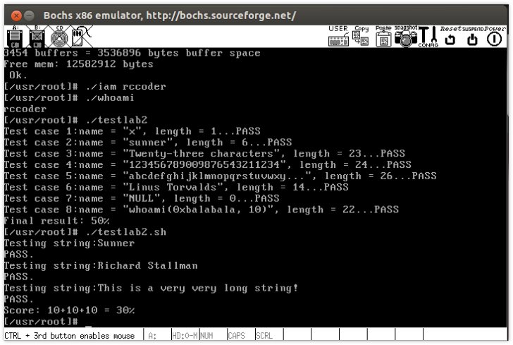

实验步骤：
===
* include/linux/sys.h 仿照添加  两处
* include/unistd.h    添加系统调用号
* kernel/system_call.s 改变系统调用总数
* kernel/who.c         写要实现的系统调用函数   需要include/asm/segment.h 帮助调用输入输出
* kernel/Makefile      修改，让who.c和其他代码编译在一起

运行截图：
===


Answers:
1. 从Linux 0.11现在的机制看，它的系统调用最多能传递几个参数？你能想出办法来扩大这个限制吗？  
从linux-0.11/include/unistd.h中可以知道_syscall宏展开的系统调用最多3个参数，使用ebx，ecx，edx三个寄存器传递参数。  
解决限制的方法：将需要传递的多个参数保存在有特定结构的区间中，并将该用户态地址空间的这个区间的首地址作为一个参数传递给系统调用。最后通过寄存器间接寻址方式便可以访问所有参数。当然，这么做的话，参数合法性验证尤其必要。实际上，linux2.6内核废除了_syscall宏，而使用syscall函数，其接受一个可变参数，原理类似，参考《深入理解Linux内核（第三版）》 P409。

2. 用文字简要描述向Linux 0.11添加一个系统调用foo()的步骤。
    1. 修改 include/linux/sys.h 在sys_call_table数组最后加入sys_foo，并仿照上面给出其他系统调用格式加上
        ```c
        extern rettype sys_foo();
        ```
        修改include/unistd.h #define __NR_foo num num为接下来使用的系统调用号
    2. 然后修改 kernel/system_call.s  
        ```
            nr_system_calls = num
        ```
        num为在原值加1 即系统调用总数目加1
    3. 接着在kernel中添加 foo.c ,若需要支持内核态与用户态数据交互,则包含include/asm/segment.h，其中有put_fs_XXX  get_fs_XXX函数,在foo.c实现系统调用sys_foo()
    4. 最后修改kernel的Makefile，将foo.c与内核其它代码编译链接到一起系统调用用户界面要 
        ```c
        #define __LIBRARY__
        #include <unistd.h>
        ```
        _syscallN宏展开系统调用，提供用户态的系统调用接口（参数数目确定具体宏）