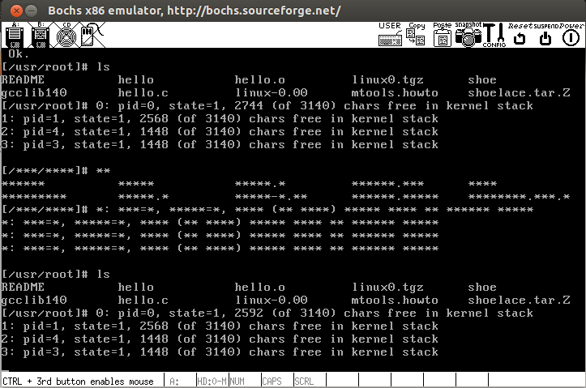

步骤
---
1. 修改tty_io.c
2. console.c

Answer
---
1.在原始代码中，按下F12，中断响应后，中断服务程序会调用func？它实现的是什么功能？

调用了show_stat，用来打印进程的状态信息

2.在你的实现中，是否把向文件输出的字符也过滤了？如果是，那么怎么能只过滤向终端输出的字符？如果不是，那么怎么能把向文件输出的字符也一并进行过滤？

不影响文件输出，con_write函数是只针对于控制台输出的，控制台输出和文件输出的缓冲队列以及其他结构是相互独立的

截图
---
